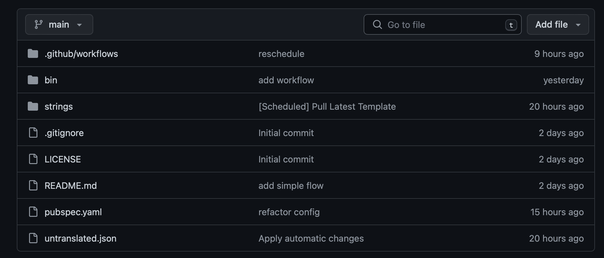
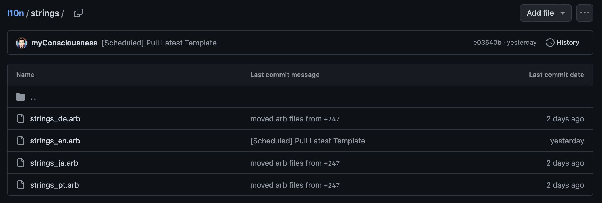
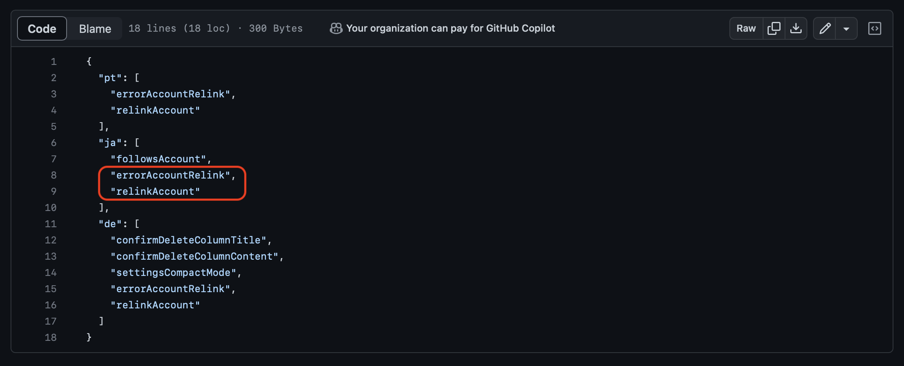
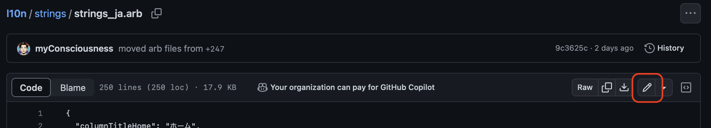
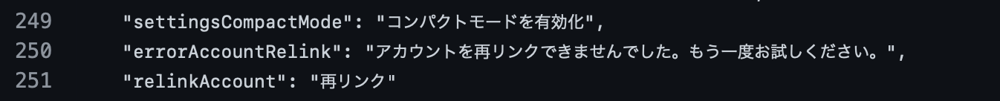
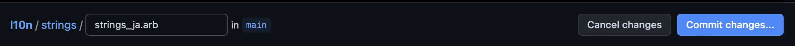
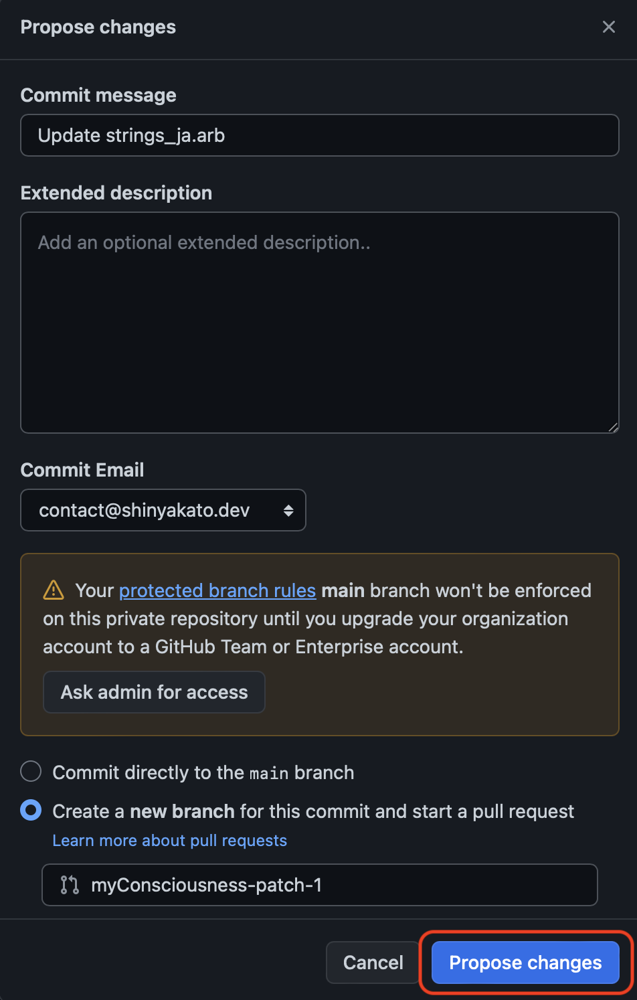
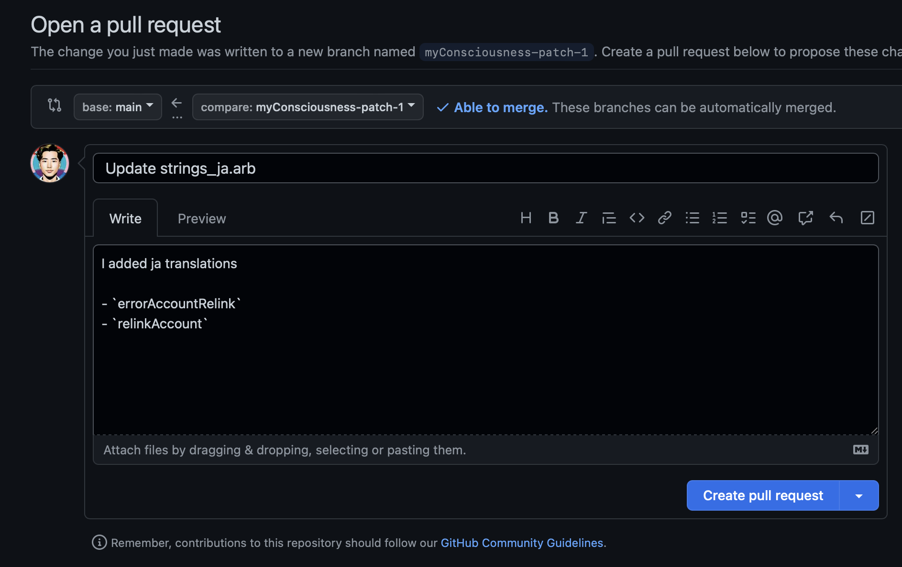
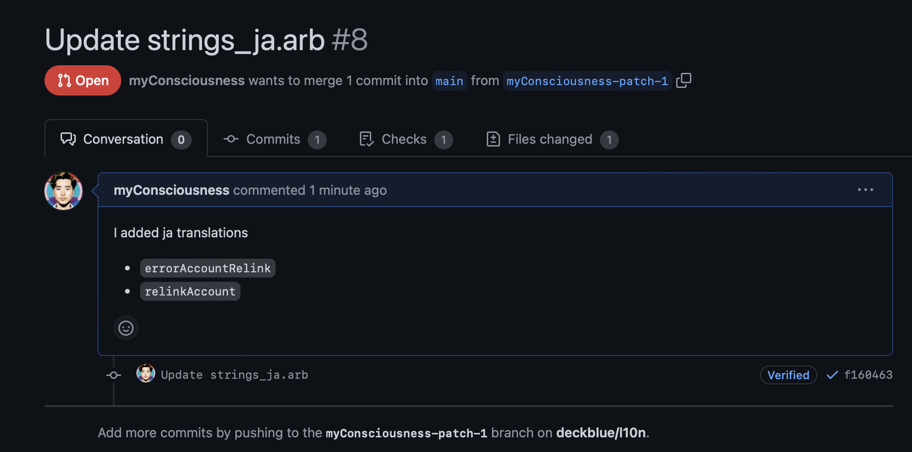

# How to help

There are mainly two ways to contribute to **[deck.blue](https://deck.blue)**'s localization from this repository. The first, and easiest, is to **edit the translation files directly in this repository on GitHub**. The second is to **clone this repository to your local machine, edit the translation files with an editor such as VSCode**, and then make a pull request.

We recommend the second method within the above, but for non-techies this is not straight-forward. In either way you'll create a pull request and then contribute with confidence that the reviewers will make sure there are no mistakes in your changes. **Take it easy!**

## For non-techies

For those who are not familiar with GitHub and source code editing, this section describes how to easily edit files on GitHub.

### Find/Add the language you want to translate

All translation information for deck.blue is in the [strings](https://github.com/deckblue/l10n/tree/main/strings) folder. All translation files have the extension `.arb`, and the name is followed by a naming convention that combines an underscore with the language code, like `strings_en.arb`.

| Starting point                                    | Where translation files are stored                |
| ------------------------------------------------- | ------------------------------------------------- |
|  |  |

### Adding a new language

Start by copying the full `strings_en.arb` file, then rename it to have the language tag based on the [IANA list](https://www.iana.org/assignments/language-subtag-registry/language-subtag-registry). For example, to add French, you would rename the file to `strings_fr.arb`. If it's a language that needs the full tag, such as Spanish (es) vs Latin America Spanish (es-419), the files would be `strings_es.arb` and `strings_es_419.arb` respectively.

### Edit translation file

Before editing an `.arb` file, check [untranslated.json](https://github.com/deckblue/l10n/blob/main/untranslated.json) first. This file contains all untranslated items based on `strings_en.arb`, in other words the items listed in this file have not yet been translated by anyone. For this example, I will add these untranslated items to `strings_ja.arb`.

| Untranslated items                                |
| ------------------------------------------------- |
|  |

First, click on the arb file you wish to edit to open it. In this example I opened `strings_ja.arb`. Then you should see a pen (edit) icon in the upper right corner of the editor as shown in the next image. Click on it to open the editing window. And then please edit file as you want!

| Press edit icon                                   | Edit file                                         |
| ------------------------------------------------- | ------------------------------------------------- |
|  |  |

### Create a pull request

When you have finished editing the file, commit your changes and create a **pull request**.

A **pull request** is a way for the maintainers of this repository to review your modifications, rather than having your modifications go directly to this repository. So don't worry, press the `Commit changes...` button at the top of the edit screen.

Then you will get a pop-up to enter information about the commit, and you can press the `Process changes` button.

| Commit button                                     | Let's commit                                      |
| ------------------------------------------------- | ------------------------------------------------- |
|  |  |

**We're almost there!**

Pressing the `Process changes` button in the previous step finally opens the screen for creating a pull request. There is an input field to enter a description of the pull request, please write a brief description of the changes you have made. Or simply say `Hello!`.

Then, just press `Create pull request` button. Congrats, your pull request is finally open!

| Write a brief description                         | Your pull request                                 |
| ------------------------------------------------- | ------------------------------------------------- |
|  |  |

Your pull request will then be merged into the repository once the review is complete. Please wait to hear good news from reviewers!
