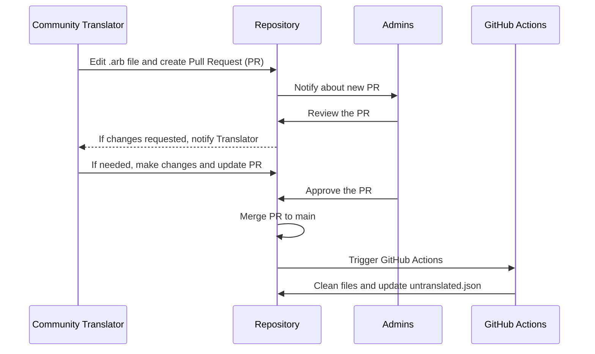

# l10n

Community managed translations for [deck.blue](https://deck.blue) are here!

## How to help?

If you just want to update an existing language, just edit the file based on the original `strings_en.arb` and `untranslated.json` files.

- The `strings_en.arb` file will have a description (that can also be updated) explaining wher that specific text is used within the app.
- The `untranslated.json` file will group all untranslated text between all languages, please be sure to check that first!
- Please, only add/edit what you see in `strings_en.arb` which is the main file, any strings that aren't there will be removed.

Please read [CONTRIBUTING.md](CONTRIBUTING.md) for more detailed contribution instructions as well as how to add a new language!

## Approval Flow

