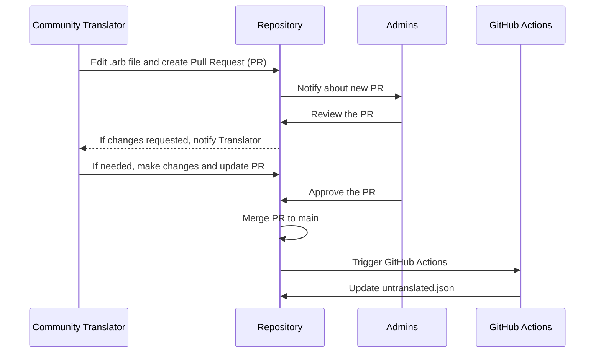

# l10n

Community managed translations for deck.blue are here!

## How to help?

If you just want to update an existing language, just edit the file based on the original `strings_en.arb` and `untranslated.json` files.

- The `strings_en.arb` file will have a description (that can also be updated) explaining wher that specific text is used within the app.
- The `untranslated.json` files will group all untranslated text between all languages, please be sure to check that first!

## Adding a new language

Start by copying the full `strings_en.arb` file, then rename it to have the language tag based on the [IANA list](https://www.iana.org/assignments/language-subtag-registry/language-subtag-registry). For example, to add French, you would rename the file to `strings_fr.arb`. If it's a language that needs the full tag, such as Spanish (es) vs Latin America Spanish (es-419), the files would be `strings_es.arb` and `strings_es_419.arb` respectively.

## Reviewing

Since this is a collaborative repository, I turned on the 2 approval requirement for new languages, and 1 approval requirement for updating an existing language. Please help me help you to help users in your language by reviewing new additions and making sure it looks and feels correct for many users to see.

## Approval Flow

